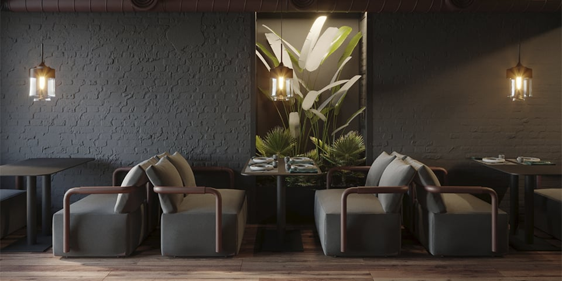
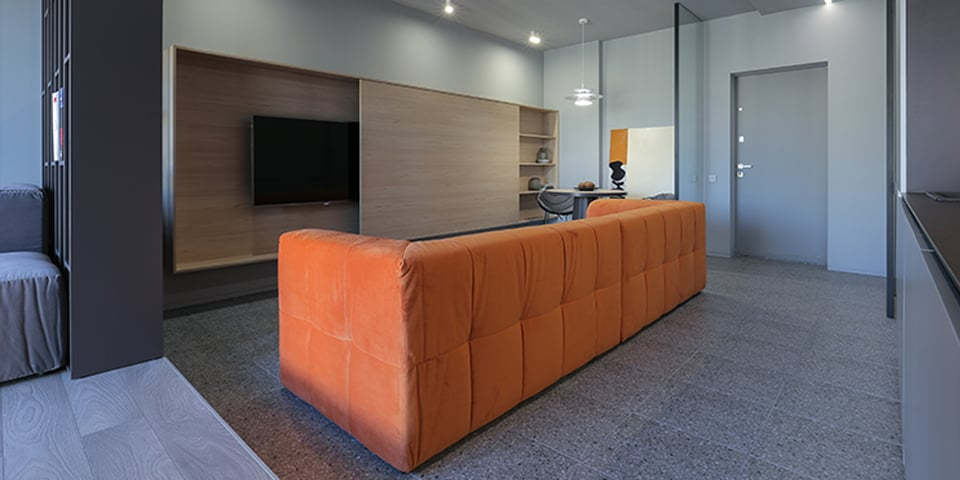
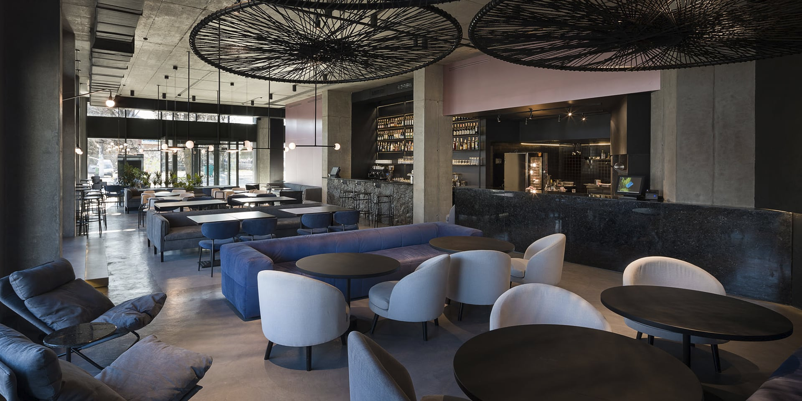
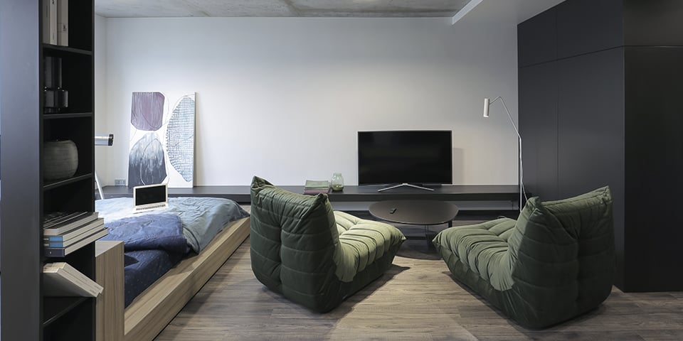
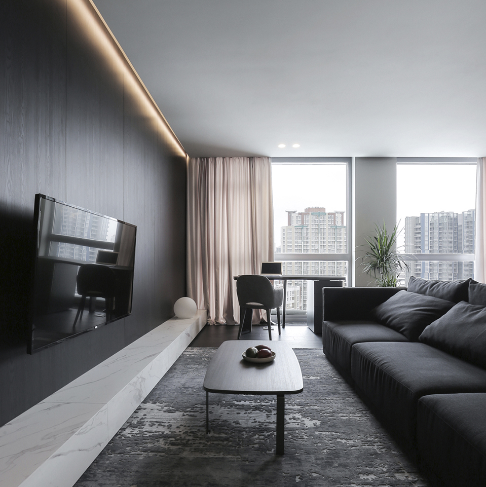
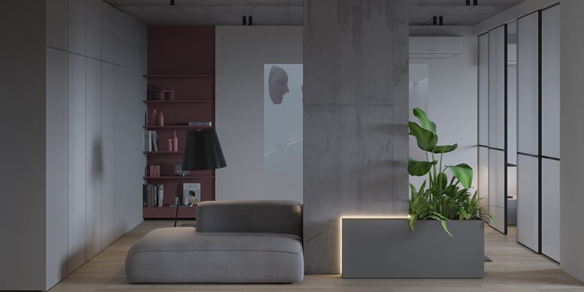
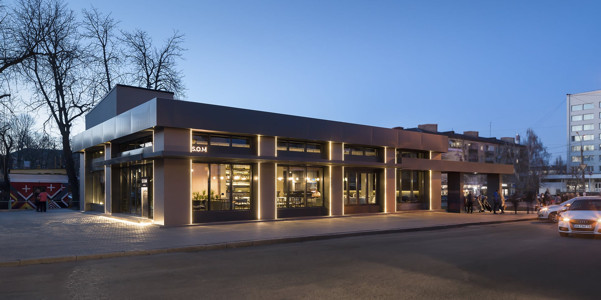
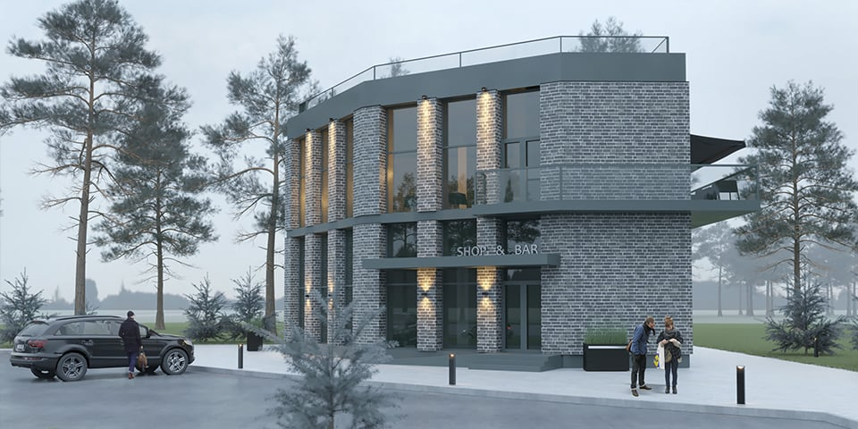
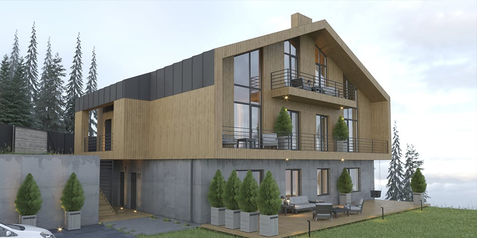

<h2>INTERIORS</h2>
<a href="en/interior">view all</a>

    

        
<h3><a href="/interior/sous">SOUS</a></h3>

    

    

        
<h3><a href="/interior/fsp">F.S.P</a></h3>

    

    

        
<h3><a href="/interior/som">S.O.M</a></h3>

    

    

        
<h3><a href="/interior/sms">S.M.S</a></h3>

    

    

        
<h3><a href="/interior/lps">L.P.S</a></h3>

    

    

        
<h3><a href="/interior/ffb">F.F.B</a></h3>

    

<h2>ARCHITECTURE</h2>
<a href="en/architecture">view all</a>

    

        
<h3><a href="/architecture/som-architecture">S.O.M</a></h3>

    

    

        
<h3><a href="/architecture/fg">FG building</a></h3>

    

    

        
<h3><a href="/architecture/chalet">CHALET</a></h3>

    

