<h2>Интерьеры Жилые Общественные</h2>

    
[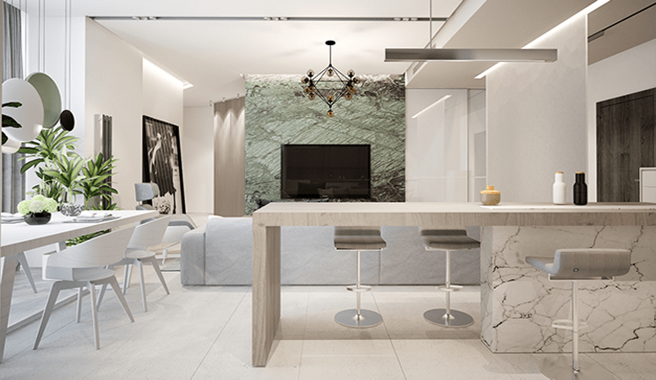](../interior/anri)
        <h3 class="project-title">ANRI</h3>
    

    
[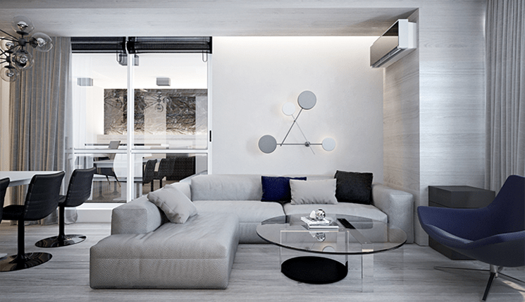](../interior/silver)
        <h3 class="project-title">SILVER</h3>
    

    
[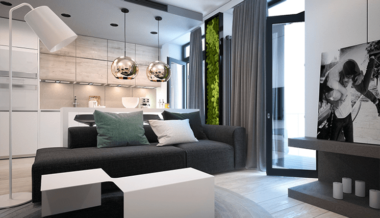](../interior/green)
        <h3 class="project-title">GREEN</h3>
    

    
[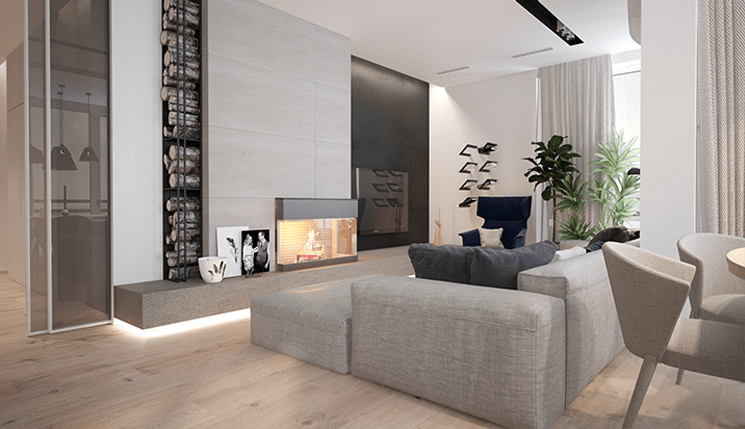](../interior/l&d)
        <h3 class="project-title">L&D</h3>
    

    
[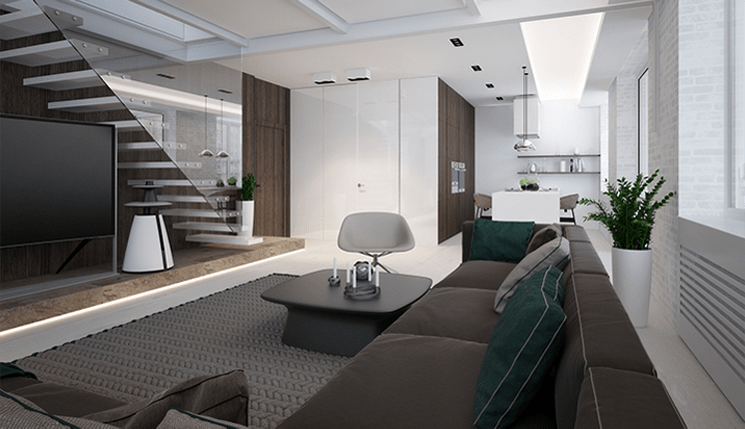](../interior/light-loft)
        <h3 class="project-title">LIGHT LOFT</h3>
    

    

        <h3 class="project-title">B.B.STUDIO</h3>
    

    
[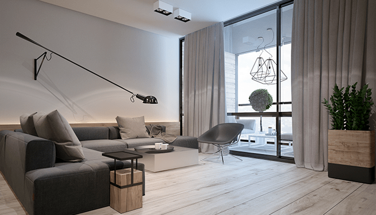](../interior/gray)
        <h3 class="project-title">GRAY</h3>
    

    
[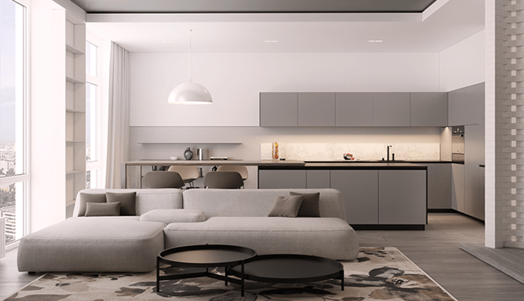](../interior/oliva)
        <h3 class="project-title">OLIVA</h3>
    

    
[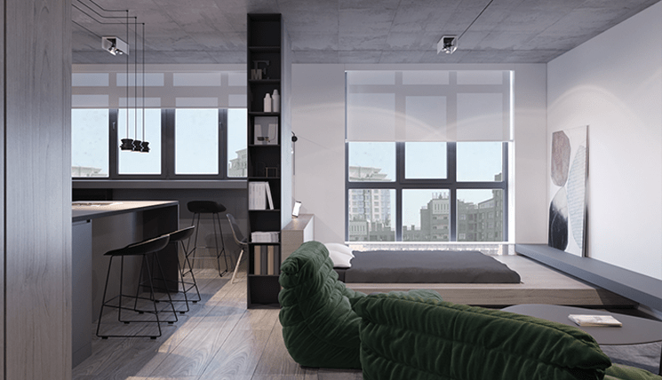](../interior/sms)
        <h3 class="project-title">SMS</h3>
    

    
[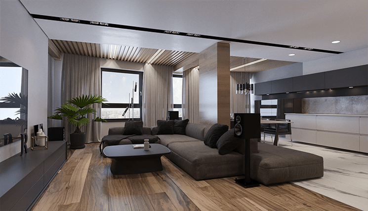](../interior/l-apartment)
        <h3 class="project-title">L-APARTMENT</h3>
    

    
[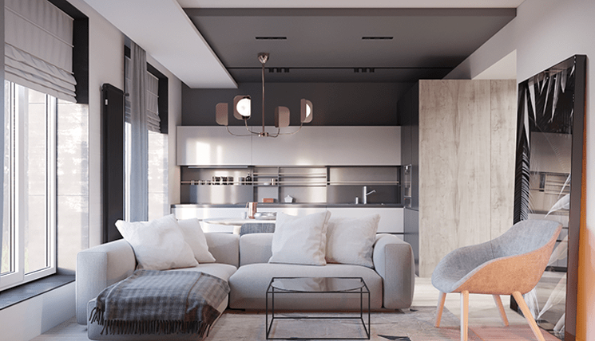](../interior/j7-family)
        <h3 class="project-title">J7-FAMILY</h3>
    

    
[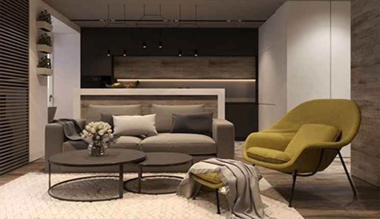](../interior/grafit)
        <h3 class="project-title">GRAFIT</h3>
    

    
[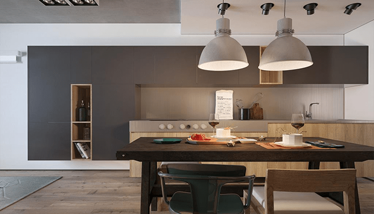](../interior/urban-forest)
        <h3 class="project-title">URBAN FOREST</h3>
    

    
[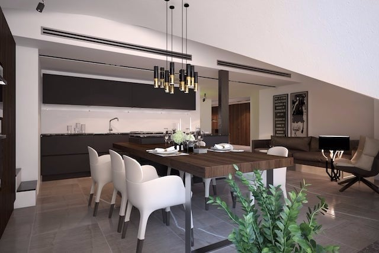](../interior/roof)
        <h3 class="project-title">ROOF</h3>
    

    
[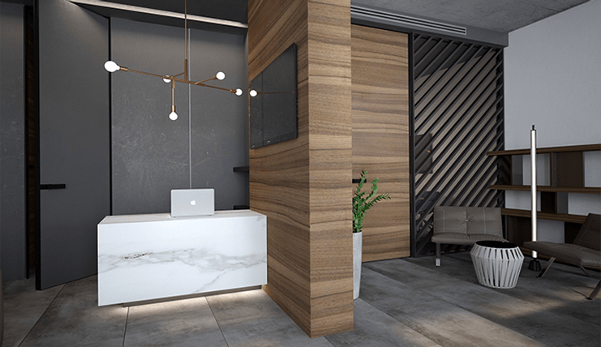](../interior/l-office)
    	<h3 class="project-title">L-OFFICE</h3> 
    

    
[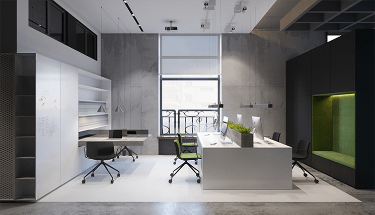](../interior/udg)
        <h3 class="project-title">UDG</h3>
    

