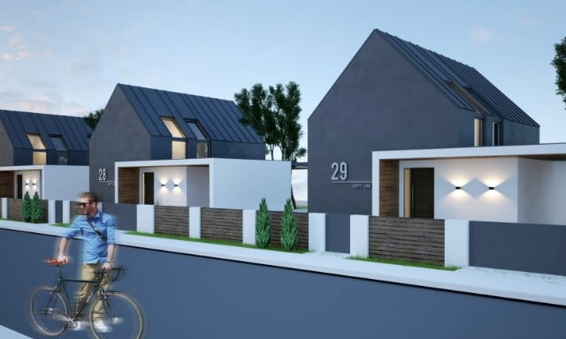
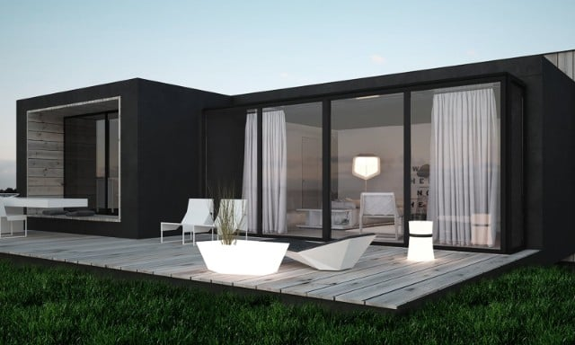
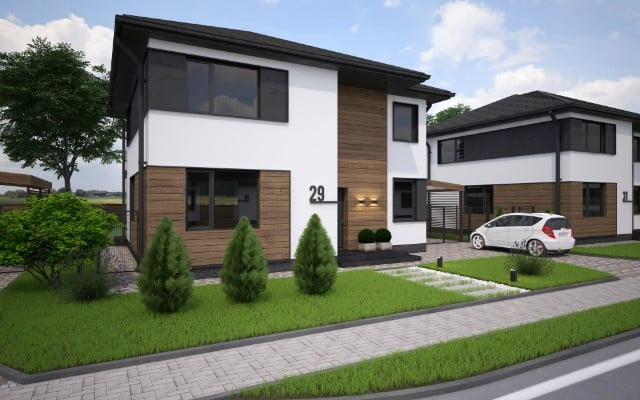

<h1>Архитектура</h1>

    

        
<h3><a href="/architecture/cottage-village">COTTAGE VILLAGE</a></h3>

    

    

        
<h3><a href="/architecture/holiday-home">HOLIDAY HOME</a></h3>

    

    

        
<h3><a href="/architecture/cottage-village-2">COTTAGE VILLAGE 2</a></h3>

    

