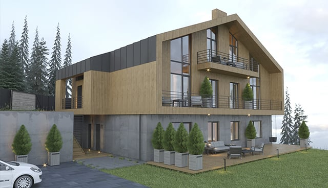
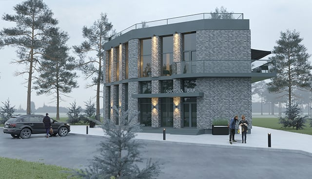

<h1>Архитектура</h1>

     

        
<h3><a href="architecture/som-architecture">S.O.M</a></h3>

    

     

        
<h3><a href="architecture/chalet">CHALET</a></h3>

    

     

        
<h3><a href="architecture/fg">FG building</a></h3>

    

    

        
<h3><a href="architecture/cottage-village">COTTAGE VILLAGE</a></h3>

    

