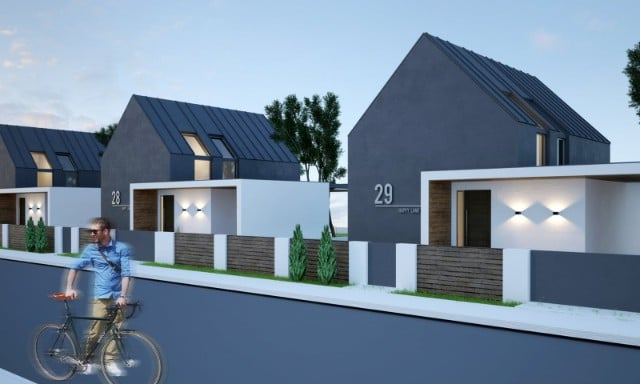
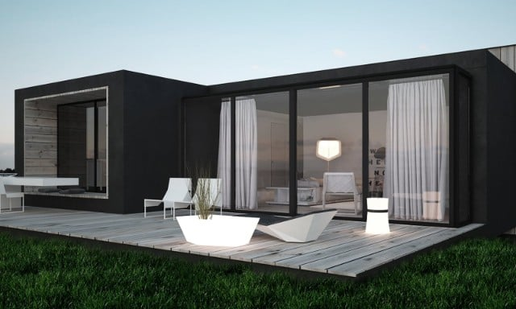
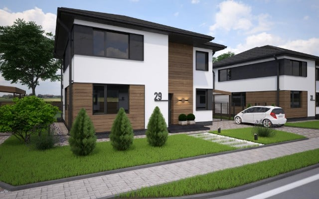

<h2>Архитектура</h2>

    

        <h3 class="project-title">COTTAGE VILLAGE</h3>
    

    

        <h3 class="project-title">HOLIDAY HOME</h3>
    

    

        <h3 class="project-title">COTTAGE VILLAGE 2</h3>
    

